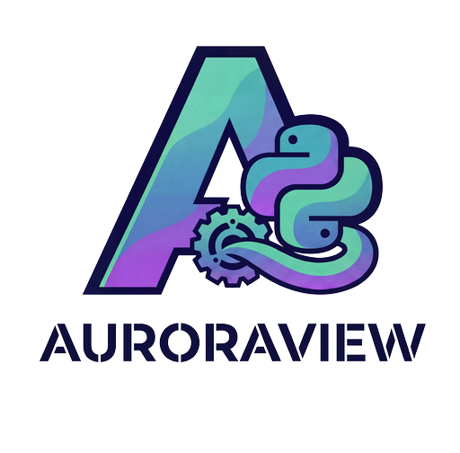
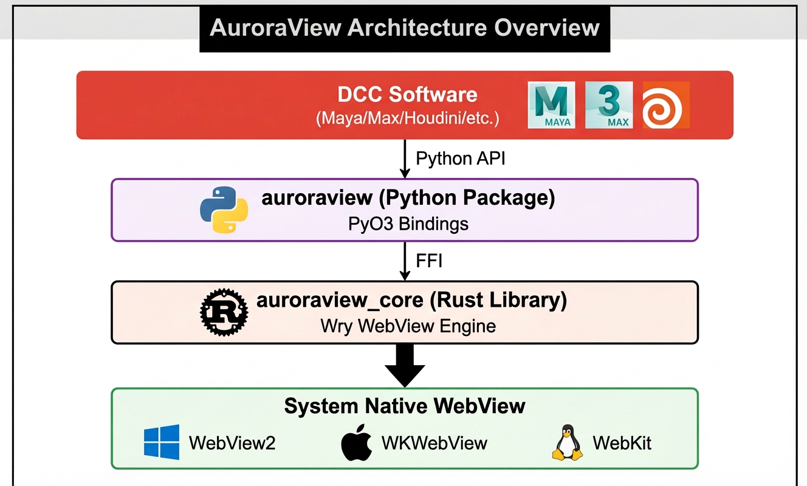

<p align="center">
  
</p>

<p align="center">
  中文文档 | <a href="./README.md">English</a>
</p>

<p align="center">
  <a href="https://pypi.org/project/auroraview/"></a>
  <a href="https://pypi.org/project/auroraview/"></a>
  <a href="https://pepy.tech/project/auroraview"></a>
  <a href="https://codecov.io/gh/loonghao/auroraview"></a>
  <a href="https://github.com/loonghao/auroraview/actions/workflows/pr-checks.yml"></a>
  <a href="https://opensource.org/licenses/MIT"></a>
</p>

<p align="center">
  <a href="https://www.rust-lang.org/"></a>
  <a href="https://github.com/loonghao/auroraview"></a>
  <a href="https://github.com/loonghao/auroraview/actions/workflows/ci.yml"></a>
  <a href="https://github.com/loonghao/auroraview/actions/workflows/build-wheels.yml"></a>
  <a href="https://github.com/loonghao/auroraview/actions/workflows/release.yml"></a>
</p>

<p align="center">
  <a href="https://github.com/loonghao/auroraview/actions/workflows/codeql.yml"></a>
  <a href="https://github.com/loonghao/auroraview/actions/workflows/security-audit.yml"></a>
  <a href="https://github.com/loonghao/auroraview/releases"></a>
  <a href="https://pre-commit.com/"></a>
</p>

<p align="center">
  <a href="https://github.com/loonghao/auroraview/stargazers"></a>
  <a href="https://github.com/loonghao/auroraview/releases"></a>
  <a href="https://github.com/loonghao/auroraview/commits/main"></a>
  <a href="https://github.com/loonghao/auroraview/graphs/commit-activity"></a>
</p>

<p align="center">
  <a href="https://github.com/loonghao/auroraview/issues"></a>
  <a href="https://github.com/loonghao/auroraview/pulls"></a>
  <a href="https://github.com/loonghao/auroraview/graphs/contributors"></a>
  <a href="https://conventionalcommits.org"></a>
</p>

<p align="center">
  <a href="https://github.com/googleapis/release-please"></a>
  <a href="./.github/dependabot.yml"></a>
  <a href="https://docs.astral.sh/ruff/"></a>
  <a href="http://mypy-lang.org/"></a>
</p>

<p align="center">
  <a href="./CODE_OF_CONDUCT.md">行为准则</a> •
  <a href="./SECURITY.md">安全策略</a> •
  <a href="https://github.com/loonghao/auroraview/issues">问题追踪</a>
</p>


一个为DCC（数字内容创作）软件设计的轻量级WebView框架，使用Rust构建并提供Python绑定。完美支持Maya、3ds Max、Houdini、Blender等。

> **⚠️ 开发状态**: 本项目正在积极开发中。API 可能在 v1.0.0 发布前发生变化。项目尚未在 Linux 和 macOS 平台上进行广泛测试。

## 快速体验

使用 `uvx` 无需安装即可快速体验 AuroraView：

```bash
uvx auroraview --url baidu.com
```

## 概述

AuroraView 为专业DCC应用程序（如Maya、3ds Max、Houdini、Blender、Photoshop和Unreal Engine）提供现代化的Web UI解决方案。基于Rust的Wry库和PyO3绑定构建，提供原生性能和最小开销。

### 主要特性

- **轻量级**: 约5MB包体积，而Electron约120MB
- **快速**: 原生Rust性能，最小内存占用
- **无缝集成**: 为所有主流DCC工具提供简单的Python API
- **现代Web技术栈**: 支持React、Vue或任何Web框架
- **安全**: Rust的内存安全保证
- **跨平台**: 支持Windows、macOS和Linux
- **DCC优先设计**: 专为DCC软件集成而构建
- **类型安全**: Rust + Python 完整类型检查

[POINTER] **[DCC 集成指南](./docs/DCC_INTEGRATION.md)** - 了解如何将 AuroraView 集成到 Maya、Houdini、Nuke 和其他 DCC 应用程序中。

## 架构

<p align="center">
  
</p>
##  技术框架

- 核心栈：Rust 1.75+、PyO3 0.22（abi3）、Wry 0.47、Tao 0.30
- 引擎：Windows（WebView2）、macOS（WKWebView）、Linux（WebKitGTK）
- 打包：maturin + abi3 → 单个 wheel 兼容 CPython 3.7-3.13
- 事件循环：默认阻塞式 show()；后续提供非阻塞模式以适配宿主循环
- 延迟加载：在 show() 前设置的 URL/HTML 会保存并在创建时应用（最后写入生效）
- IPC：Python ↔ JavaScript 双向事件总线（基于 CustomEvent）
- 协议：自定义协议与资源加载（如 dcc://）
- 嵌入：支持父窗口句柄（HWND/NSView/WId）的 DCC 宿主嵌入（路线图）
- 安全：可选的开发者工具、CSP 钩子、远程 URL 白名单（规划中）
- 性能目标：本地 HTML 首屏 <150ms、基线内存 <50MB

### 技术细节
- Python API：`auroraview.WebView` 封装 Rust 核心并提供易用增强
- Rust 核心：使用 Arc<Mutex<...>> 的内部可变配置，安全支持 show() 前更新
- 生命周期：在 `show()` 时创建 WebView，并应用 URL/HTML（最后写入生效）
- JS 桥：Python 侧 `emit(event, data)`；JS 侧通过 `CustomEvent('py', {...})` 回传到 Python（IpcHandler）
- 日志：Rust 端 `tracing`；Python 端 `logging`
- 测试：pytest 冒烟 + cargo 测试；CI 构建三平台 wheel


## 特性

### 核心功能
- [OK] **原生 WebView 集成**: 使用系统 WebView (WebView2/WKWebView/WebKitGTK)，占用空间最小
- [OK] **双向通信**: Python ↔ JavaScript IPC，支持 async/await
- [OK] **自定义协议处理器**: 从 DCC 项目加载资源 (`auroraview://`、自定义协议)
- [OK] **事件系统**: Node.js 风格 EventEmitter，支持 `on()`、`once()`、`off()`、`emit()`
- [OK] **多窗口支持**: WindowManager 管理多窗口，支持跨窗口事件通信
- [OK] **线程安全**: Rust 保证的内存安全和并发操作

### 存储与数据
- [OK] **localStorage/sessionStorage**: 完整的 Web 存储 CRUD 操作
- [OK] **Cookie 管理**: set/get/delete/clear cookies
- [OK] **浏览数据清理**: 通过 `clear_browsing_data()` 清理缓存、Cookie、历史

### 窗口与导航
- [OK] **文件对话框**: open_file、save_file、select_folder、select_folders
- [OK] **消息对话框**: confirm、alert、error、ok_cancel
- [OK] **导航控制**: go_back、go_forward、reload、stop、can_go_back/forward
- [OK] **窗口事件**: on_window_show/hide/focus/blur/resize、on_fullscreen_changed
- [OK] **文件拖放事件**: 原生拖放支持完整文件路径（file_drop、file_drop_hover、file_paste）
- [OK] **可取消事件**: 事件处理器可以取消事件（例如阻止窗口关闭）
- [OK] **事件工具**: 高频事件的防抖/节流辅助函数

### DCC 集成
- [OK] **生命周期管理**: 父 DCC 应用关闭时自动清理
- [OK] **Qt 后端**: QtWebView 无缝集成基于 Qt 的 DCC
- [OK] **WebView2 预热**: 预初始化 WebView2 加速 DCC 启动
- [OK] **性能监控**: get_performance_metrics()、get_ipc_stats()

### 桌面功能
- [OK] **系统托盘**: 系统托盘图标，右键菜单，最小化到托盘，点击显示
- [OK] **工具窗口**: 通过 `tool_window=True` 隐藏任务栏/Alt+Tab (WS_EX_TOOLWINDOW)
- [OK] **浮动面板**: 无边框透明窗口，适用于 AI 助手和工具面板
- [OK] **Owner 模式**: 通过 `embed_mode="owner"` 实现窗口跟随父窗口最小化/恢复

### 插件系统
- [OK] **Rust 插件架构**: 高性能插件系统，支持 IPC
- [OK] **进程插件**: 运行外部进程，支持 stdout/stderr 流式输出
- [OK] **文件系统插件**: 原生文件操作（读取、写入、复制、移动）
- [OK] **对话框插件**: 原生文件/文件夹对话框和消息框
- [OK] **Shell 插件**: 执行命令、打开 URL、在文件管理器中显示
- [OK] **剪贴板插件**: 系统剪贴板读写访问

### Chrome 扩展 API 兼容
- [OK] **25+ Chrome API**: 完整的 Chrome Extension API polyfill 层
- [OK] **Storage API**: `chrome.storage.local/sync/session` 持久化存储
- [OK] **Bookmarks API**: 创建、搜索、更新、删除书签
- [OK] **History API**: 搜索和管理浏览历史
- [OK] **Downloads API**: 下载文件并跟踪进度
- [OK] **Cookies API**: 获取、设置、删除 Cookie
- [OK] **Notifications API**: 带操作的系统通知
- [OK] **TTS API**: 文字转语音合成
- [OK] **Idle/Power API**: 用户活动检测和电源管理
- [OK] **WXT 框架**: 兼容现代扩展开发框架

### Gallery 应用
- [OK] **交互式展示**: 基于 React 的 Gallery，展示所有功能
- [OK] **示例运行器**: 运行任意示例，实时显示 stdout/stderr 输出
- [OK] **分类浏览器**: 按类别组织示例，支持搜索
- [OK] **Pack 命令**: 通过 `auroraview pack` 构建独立 Gallery 可执行文件

### 安全
- [OK] **CSP 配置**: 内容安全策略支持
- [OK] **CORS 控制**: 跨域资源共享管理
- [OK] **权限系统**: 细粒度权限控制

## 快速开始

### 安装

#### Windows 和 macOS

```bash
pip install auroraview
```

#### Linux

由于 webkit2gtk 系统依赖，Linux wheels 不在 PyPI 上提供。请从 GitHub Releases 安装：

```bash
# 首先安装系统依赖
sudo apt install libwebkit2gtk-4.1-dev libgtk-3-dev  # Debian/Ubuntu
# sudo dnf install gtk3-devel webkit2gtk3-devel      # Fedora/CentOS
# sudo pacman -S webkit2gtk                          # Arch Linux

# 从 GitHub Releases 下载并安装 wheel
pip install https://github.com/loonghao/auroraview/releases/latest/download/auroraview-{version}-cp37-abi3-linux_x86_64.whl
```

或从源码构建：
```bash
pip install auroraview --no-binary :all:
```

### 集成模式

AuroraView 提供三种主要集成模式以适应不同的使用场景：

| 模式 | 类 | 适用场景 | 停靠支持 |
|------|-----|----------|----------|
| **Qt 原生** | `QtWebView` | Maya, Houdini, Nuke, 3ds Max | ✅ QDockWidget |
| **HWND** | `AuroraView` | Unreal Engine, 非 Qt 应用 | ✅ 通过 HWND API |
| **独立** | `run_standalone` | 桌面应用程序 | N/A |

### WebView vs AuroraView: 选择合适的类

了解 `WebView` 和 `AuroraView` 的区别有助于你选择适合的类：

| 特性 | `WebView` | `AuroraView` |
|------|-----------|--------------|
| **用途** | 核心类，直接 Rust 绑定 | HWND 集成的高级封装 |
| **API 风格** | Mixin 模式，完全控制 | 简化的委托模式 |
| **适用场景** | 高级定制，DCC 嵌入 | Unreal Engine，快速原型 |
| **保活机制** | 手动管理 | 自动（类级别注册表） |
| **API 绑定** | 手动调用 `bind_api()` | 通过 `api` 参数自动绑定 |
| **生命周期钩子** | `on_loaded`、`on_shown` 等 | `on_show`、`on_hide`、`on_close`、`on_ready` |

**何时使用 `WebView`：**
- 需要完全控制 WebView 生命周期
- 构建基于 Qt 的 DCC 集成（配合 `QtWebView` 使用）
- 需要高级功能如自定义协议、资源根目录等

**何时使用 `AuroraView`：**
- 与 Unreal Engine 或其他基于 HWND 的应用集成
- 希望使用更简单的 API 和自动保活管理
- 从 pywebview 迁移并希望使用熟悉的 API

**示例：WebView（核心类）**
```python
from auroraview import WebView

# 完全控制模式
webview = WebView.create(
    title="我的工具",
    url="http://localhost:3000",
    auto_show=True,
    auto_timer=True
)
webview.bind_api(my_api_object)  # 手动 API 绑定
webview.show()
```

**示例：AuroraView（HWND 封装）**
```python
from auroraview import AuroraView

# 简化模式，自动 API 绑定
webview = AuroraView(
    url="http://localhost:3000",
    api=my_api_object  # 构造时自动绑定
)
webview.show()
```

#### 1. Qt 原生模式 (QtWebView)

**最适合基于 Qt 的 DCC 应用程序** - Maya, Houdini, Nuke, 3ds Max。

此模式创建真正的 Qt 控件，可以停靠、嵌入布局，并由 Qt 的父子系统管理。

```python
from auroraview import QtWebView
from qtpy.QtWidgets import QDialog, QVBoxLayout

# 创建可停靠对话框
dialog = QDialog(maya_main_window())
layout = QVBoxLayout(dialog)

# 创建嵌入式 WebView 作为 Qt 控件
webview = QtWebView(
    parent=dialog,
    width=800,
    height=600
)
layout.addWidget(webview)

# 加载内容
webview.load_url("http://localhost:3000")

# 显示对话框 - WebView 会随父窗口自动关闭
dialog.show()
webview.show()
```

**主要特性：**
- ✅ 支持 `QDockWidget` 可停靠面板
- ✅ 自动生命周期管理（随父窗口关闭）
- ✅ 原生 Qt 事件集成
- ✅ 支持所有 Qt 布局管理器

#### 2. HWND 模式 (AuroraView)

**最适合 Unreal Engine 和非 Qt 应用程序**，需要直接访问窗口句柄。

```python
from auroraview import AuroraView

# 创建独立 WebView
webview = AuroraView(url="http://localhost:3000")
webview.show()

# 获取 HWND 用于外部集成
hwnd = webview.get_hwnd()
if hwnd:
    # Unreal Engine 集成
    import unreal
    unreal.parent_external_window_to_slate(hwnd)
```

**主要特性：**
- ✅ 通过 `get_hwnd()` 直接访问 HWND
- ✅ 适用于任何接受 HWND 的应用程序
- ✅ 无需 Qt 依赖
- ✅ 完全控制窗口定位

#### 3. 独立模式

**最适合桌面应用程序** - 一行代码启动独立应用。

```python
from auroraview import run_standalone

# 启动独立应用（阻塞直到关闭）
run_standalone(
    title="我的应用",
    url="https://example.com",
    width=1024,
    height=768
)
```

**主要特性：**
- 最简单的 API - 一个函数调用
- 自动事件循环管理
- 无需父窗口

### 快速开始

**桌面应用（一行代码）：**
```python
from auroraview import run_desktop

# 启动独立应用 - 阻塞直到关闭
run_desktop(title="我的应用", url="http://localhost:3000")
```

**Maya 集成（Qt 模式）：**
```python
from auroraview import QtWebView
import maya.OpenMayaUI as omui

# 创建 WebView 作为 Qt 控件
webview = QtWebView(
    parent=maya_main_window(),
    url="http://localhost:3000",
    width=800,
    height=600
)
webview.show()  # 非阻塞，自动定时器
```

**Houdini 集成（Qt 模式）：**
```python
from auroraview import QtWebView
import hou

webview = QtWebView(
    parent=hou.qt.mainWindow(),
    url="http://localhost:3000"
)
webview.show()  # 非阻塞，自动定时器
```

**Unreal Engine 集成（HWND 模式）：**
```python
from auroraview import AuroraView

webview = AuroraView(url="http://localhost:3000")
webview.show()

# 获取 HWND 用于 Unreal 嵌入
hwnd = webview.get_hwnd()
if hwnd:
    import unreal
    unreal.parent_external_window_to_slate(hwnd)
```

### 命令行界面

AuroraView 包含一个 CLI，用于快速启动 WebView 窗口：

```bash
# 加载 URL
auroraview --url https://example.com

# 加载本地 HTML 文件
auroraview --html /path/to/file.html

# 自定义窗口配置
auroraview --url https://example.com --title "我的应用" --width 1024 --height 768

# 使用 uvx（无需安装）
uvx auroraview --url https://example.com
```

> **Python 3.7 Windows 用户注意**：由于 [uv/uvx 的限制](https://github.com/astral-sh/uv/issues/10165)，请使用 `python -m auroraview` 代替：
> ```bash
> uvx --python 3.7 --from auroraview python -m auroraview --url https://example.com
> ```

**[查看 CLI 文档](./docs/CLI.md)** 了解更多详情。

### 自定义窗口图标

AuroraView 默认显示 AuroraView 图标。你可以自定义图标：

```python
from auroraview import WebView

# 使用自定义图标
webview = WebView.create(
    "我的应用",
    url="http://localhost:3000",
    icon="path/to/my-icon.png"  # 自定义图标路径
)
webview.show()
```

**图标要求：**
| 属性 | 推荐 |
|------|------|
| **格式** | PNG（推荐）、ICO、JPEG、BMP、GIF |
| **尺寸** | 32x32（任务栏）、64x64（Alt-Tab）、256x256（高 DPI） |
| **色深** | 32 位 RGBA 以支持透明度 |
| **最佳实践** | 使用正方形图片；非正方形图片会被拉伸 |

> **提示**：为了在所有 Windows UI 元素中获得最佳效果，请提供带透明度的 32x32 PNG。

**Nuke 集成：**
```python
from auroraview import WebView
from qtpy import QtWidgets

main = QtWidgets.QApplication.activeWindow()
hwnd = int(main.winId())
webview = WebView.create("Nuke 工具", url="http://localhost:3000", parent=hwnd)
webview.show()  # 嵌入模式：非阻塞，自动定时器
```

**Blender 集成：**
```python
from auroraview import WebView

# Blender 以独立模式运行（无父窗口）
webview = WebView.create("Blender 工具", url="http://localhost:3000")
webview.show()  # 独立模式：阻塞直到关闭（使用 show(wait=False) 异步）
```

**回调反注册（EventTimer）**：
```python
from auroraview import EventTimer

timer = EventTimer(webview, interval_ms=16)

def _on_close(): ...

timer.on_close(_on_close)
# 之后如需移除：
timer.off_close(_on_close)  # 也支持：off_tick(handler)
```

**共享状态（借鉴 PyWebView）**：

AuroraView 提供 Python 和 JavaScript 之间的自动双向状态同步：

```python
from auroraview import WebView

webview = WebView.create("我的应用", width=800, height=600)

# 访问共享状态（类字典接口）
webview.state["user"] = "Alice"
webview.state["theme"] = "dark"
webview.state["count"] = 0

# 跟踪状态变化
@webview.state.on_change
def on_state_change(key: str, value, old_value):
    print(f"状态变化: {key} = {value} (原值 {old_value})")

# 在 JavaScript 中：
# window.auroraview.state.user = "Bob";  // 同步到 Python
# console.log(window.auroraview.state.theme);  // "dark"
```

**命令系统（借鉴 Tauri）**：

将 Python 函数注册为可从 JavaScript 调用的 RPC 风格命令：

```python
from auroraview import WebView

webview = WebView.create("我的应用", width=800, height=600)

# 使用装饰器注册命令
@webview.command
def greet(name: str) -> str:
    return f"你好, {name}!"

@webview.command("add_numbers")
def add(x: int, y: int) -> int:
    return x + y

# 在 JavaScript 中：
# const msg = await auroraview.invoke("greet", {name: "World"});
# const sum = await auroraview.invoke("add_numbers", {x: 1, y: 2});
```

**Channel 流式传输**：

使用 Channel 从 Python 向 JavaScript 流式传输大数据：

```python
from auroraview import WebView

webview = WebView.create("我的应用", width=800, height=600)

# 创建用于流式传输的 channel
with webview.create_channel() as channel:
    for i in range(100):
        channel.send({"progress": i, "data": f"chunk_{i}"})

# 在 JavaScript 中：
# const channel = auroraview.channel("channel_id");
# channel.onMessage((data) => console.log("收到:", data));
# channel.onClose(() => console.log("流传输完成"));
```

## 使用模式

AuroraView 支持多种 API 风格以适应不同的开发工作流。选择最适合项目复杂度和团队偏好的模式。

### 模式 1：装饰器风格（最简单）

适用于：**快速原型、简单工具、一次性脚本**

```python
from auroraview import WebView

view = WebView(title="我的工具", url="http://localhost:3000")

# 使用 bind_call 装饰器注册 API 方法
@view.bind_call("api.get_data")
def get_data() -> dict:
    """JS 调用: await auroraview.api.get_data()"""
    return {"items": [1, 2, 3], "count": 3}

@view.bind_call("api.save_file")
def save_file(path: str = "", content: str = "") -> dict:
    """JS 调用: await auroraview.api.save_file({path: "/tmp/a.txt", content: "hello"})"""
    with open(path, "w") as f:
        f.write(content)
    return {"ok": True, "path": path}

# 注册事件处理器（无返回值）
@view.on("button_clicked")
def handle_click(data: dict):
    """JS 发送时调用: auroraview.send_event("button_clicked", {...})"""
    print(f"按钮点击: {data['id']}")

view.show()
```

**JavaScript 端：**
```javascript
// 调用 API 方法（有返回值）
const data = await auroraview.api.get_data();
console.log(data.items);  // [1, 2, 3]

const result = await auroraview.api.save_file({ path: "/tmp/test.txt", content: "Hello" });
console.log(result.ok);  // true

// 发送事件到 Python（即发即忘）
auroraview.send_event("button_clicked", { id: "save_btn" });

// 监听 Python 事件
auroraview.on("data_updated", (data) => {
    console.log("数据更新:", data);
});
```

### 模式 2：类继承（推荐，类 Qt 风格）

适用于：**生产工具、团队协作、复杂应用**

```python
from auroraview import WebView, Signal

class OutlinerTool(WebView):
    """Maya 风格的大纲工具，演示类 Qt 模式。"""

    # 信号定义（Python -> JS 通知）
    selection_changed = Signal(list)
    progress_updated = Signal(int, str)
    scene_loaded = Signal(str)

    def __init__(self):
        super().__init__(
            title="大纲工具",
            url="http://localhost:3000",
            width=400,
            height=600
        )
        self._setup_api()
        self._setup_connections()

    def _setup_api(self):
        """绑定 API 方法供 JavaScript 访问。"""
        self.bind_api(self, namespace="api")

    # API 方法（JS -> Python）
    def get_hierarchy(self, root: str = None) -> dict:
        """获取场景层级。JS: await auroraview.api.get_hierarchy()"""
        return {
            "children": ["group1", "mesh_cube", "camera1"],
            "count": 3
        }

    def rename_object(self, old_name: str = "", new_name: str = "") -> dict:
        """重命名场景对象。JS: await auroraview.api.rename_object({old_name: "a", new_name: "b"})"""
        return {"ok": True, "old": old_name, "new": new_name}

# 使用
tool = OutlinerTool()
tool.show()
```

### 模式 3：显式绑定（高级）

适用于：**动态配置、插件系统、运行时定制**

```python
from auroraview import WebView

view = WebView(title="插件宿主", url="http://localhost:3000")

# 单独定义函数
def get_plugins() -> dict:
    return {"plugins": ["plugin_a", "plugin_b"]}

def load_plugin(name: str) -> dict:
    print(f"加载插件: {name}")
    return {"ok": True, "plugin": name}

# 运行时显式绑定
view.bind_call("get_plugins", get_plugins)
view.bind_call("load_plugin", load_plugin)

# 连接内置信号
view.on_ready.connect(lambda: print("WebView 已就绪!"))
view.on_navigate.connect(lambda url: print(f"导航到: {url}"))

view.show()
```

### 模式对比

| 方面 | 装饰器 | 类继承 | 显式绑定 |
|------|--------|--------|----------|
| **复杂度** | 简单 | 中等 | 高级 |
| **适用场景** | 原型 | 生产 | 插件 |
| **信号支持** | 无 | 完整 | 有限 |
| **自动绑定** | 手动 | 通过 bind_api | 手动 |
| **类型提示** | 支持 | 支持 | 支持 |
| **Qt 熟悉度** | 低 | 高 | 中 |
| **可测试性** | 良好 | 优秀 | 良好 |

> **推荐**：原型开发使用**模式 1**，生产工具使用**模式 2**，构建可扩展系统时使用**模式 3**。

查看 [examples/](./examples/) 目录获取每种模式的完整可运行示例。

#### 2. Qt 后端

作为 Qt widget 集成,与基于 Qt 的 DCC 无缝集成。需要 `pip install auroraview[qt]`。

> **DCC 集成说明**: 基于 Qt 的 DCC 应用（Maya、Houdini、Nuke、3ds Max）需要 QtPy 作为中间件层来处理不同 DCC 应用之间的 Qt 版本差异。安装 `[qt]` 扩展会自动安装 QtPy。

```python
from auroraview import QtWebView

# 创建 WebView 作为 Qt widget
webview = QtWebView(
    parent=maya_main_window(),  # 任何 QWidget (可选)
    title="我的工具",
    width=800,
    height=600
)

# 加载内容
webview.load_url("http://localhost:3000")
# 或加载 HTML
webview.load_html("<html><body><h1>你好,来自 Qt!</h1></body></html>")

# 显示 widget
webview.show()
```

#### WebView2 预热（自动）

`QtWebView` 在首次实例化时自动预热 WebView2，将后续创建时间减少约 50%。无需手动设置：

```python
from auroraview.integration.qt import QtWebView

# 首个 QtWebView 自动触发预热
webview = QtWebView(parent=maya_main_window())
webview.load_url("http://localhost:3000")
webview.show()
```

**高级用户** 如需显式控制预热时机：

```python
from auroraview.integration.qt import WebViewPool, QtWebView

# 在 DCC 启动时显式预热（如在 userSetup.py 中）
WebViewPool.prewarm()

# 检查预热状态
if WebViewPool.has_prewarmed():
    print(f"预热耗时 {WebViewPool.get_prewarm_time():.2f}s")

# 使用显式控制时禁用自动预热
webview = QtWebView(parent=maya_main_window(), auto_prewarm=False)

# 完成后清理（可选，退出时自动调用）
WebViewPool.cleanup()
```

**优势：**
- ✅ 首个 `QtWebView` 创建时自动预热
- ✅ WebView 创建时间减少约 50%
- ✅ 线程安全且幂等（可安全多次调用）
- ✅ 应用退出时自动清理

**何时使用 Qt 后端:**
- [OK] 你的 DCC 已经加载了 Qt (Maya, Houdini, Nuke)
- [OK] 你想要无缝的 Qt widget 集成
- [OK] 你需要使用 Qt 布局和信号/槽

**何时使用原生后端:**
- [OK] 所有平台的最大兼容性
- [OK] 独立应用程序
- [OK] 没有 Qt 的 DCC (Blender, 3ds Max)
- [OK] 最小依赖

### 双向通信

AuroraView 提供完整的 Python 和 JavaScript 之间的双向通信系统。

#### 通信 API 概览

| 方向 | JavaScript API | Python API | 用途 |
|------|---------------|------------|------|
| JS → Python | `auroraview.call(method, params)` | `@webview.bind_call` | 带返回值的 RPC 调用 |
| JS → Python | `auroraview.send_event(event, data)` | `@webview.on(event)` | 单向事件通知 |
| Python → JS | - | `webview.emit(event, data)` | 推送通知 |
| 仅 JS | `auroraview.on(event, handler)` | - | 接收 Python 事件 |
| 仅 JS | `auroraview.trigger(event, data)` | - | JS 本地事件（不发送到 Python） |

> **重要**: `auroraview.trigger()` 仅用于 JavaScript 端本地事件。要发送事件到 Python，请使用 `auroraview.send_event()`。

#### Python → JavaScript（推送事件）

```python
# Python 端：向 JavaScript 发送事件
webview.emit("update_data", {"frame": 120, "objects": ["cube", "sphere"]})
webview.emit("selection_changed", {"items": ["mesh1", "mesh2"]})
```

```javascript
// JavaScript 端：监听 Python 事件
window.auroraview.on('update_data', (data) => {
    console.log('帧:', data.frame);
    console.log('对象:', data.objects);
});

window.auroraview.on('selection_changed', (data) => {
    highlightItems(data.items);
});
```

#### JavaScript → Python（事件）

```javascript
// JavaScript 端：发送事件到 Python
window.auroraview.send_event('export_scene', {
    path: '/path/to/export.fbx',
    format: 'fbx'
});

window.auroraview.send_event('viewport_orbit', { dx: 10, dy: 5 });
```

```python
# Python 端：注册事件处理器
@webview.on("export_scene")
def handle_export(data):
    print(f"导出到: {data['path']}")
    # 你的 DCC 导出逻辑

@webview.on("viewport_orbit")
def handle_orbit(data):
    rotate_camera(data['dx'], data['dy'])
```

#### JavaScript → Python（带返回值的 RPC）

对于请求-响应模式，使用 `auroraview.call()` 配合 `bind_call`：

```javascript
// JavaScript 端：调用 Python 方法并获取结果
const hierarchy = await auroraview.call('api.get_hierarchy', { root: 'scene' });
console.log('场景层级:', hierarchy);

const result = await auroraview.call('api.rename_object', {
    old_name: 'cube1',
    new_name: 'hero_cube'
});
if (result.ok) {
    console.log('重命名成功');
}
```

```python
# Python 端：绑定可调用方法
@webview.bind_call("api.get_hierarchy")
def get_hierarchy(root=None):
    # 返回值会发送回 JavaScript
    return {"children": ["group1", "mesh_cube"], "count": 2}

@webview.bind_call("api.rename_object")
def rename_object(old_name, new_name):
    # 在 DCC 中执行重命名
    cmds.rename(old_name, new_name)
    return {"ok": True, "old": old_name, "new": new_name}
```

#### 常见错误

```javascript
// 错误：trigger() 仅限 JS 本地，不会到达 Python
auroraview.trigger('my_event', data);  // Python 不会收到！

// 错误：dispatchEvent 是浏览器 API，不会到达 Python
window.dispatchEvent(new CustomEvent('my_event', {detail: data}));  // Python 不会收到！

// 正确：使用 send_event() 发送单向事件
auroraview.send_event('my_event', data);  // Python 通过 @webview.on() 接收

// 正确：使用 call() 进行请求-响应
const result = await auroraview.call('api.my_method', data);  // Python 通过 @webview.bind_call() 接收
```

### 窗口事件系统

AuroraView 提供完整的窗口事件系统，用于跟踪窗口生命周期：

```python
from auroraview import WebView
from auroraview.core.events import WindowEvent, WindowEventData

webview = WebView(title="我的应用", width=800, height=600)

# 使用装饰器注册窗口事件处理器
@webview.on_shown
def on_shown(data: WindowEventData):
    print("窗口已显示")

@webview.on_focused
def on_focused(data: WindowEventData):
    print("窗口获得焦点")

@webview.on_blurred
def on_blurred(data: WindowEventData):
    print("窗口失去焦点")

@webview.on_resized
def on_resized(data: WindowEventData):
    print(f"窗口大小调整为 {data.width}x{data.height}")

@webview.on_moved
def on_moved(data: WindowEventData):
    print(f"窗口移动到 ({data.x}, {data.y})")

@webview.on_closing
def on_closing(data: WindowEventData):
    print("窗口正在关闭...")
    return True  # 返回 True 允许关闭，False 取消关闭

# 窗口控制方法
webview.resize(1024, 768)
webview.move(100, 100)
webview.minimize()
webview.maximize()
webview.restore()
webview.toggle_fullscreen()
webview.focus()
webview.hide()

# 只读窗口属性
print(f"大小: {webview.width}x{webview.height}")
print(f"位置: ({webview.x}, {webview.y})")
```

### 高级功能

#### 自定义协议处理器

AuroraView 提供强大的自定义协议系统，解决本地资源加载的 CORS 限制问题。

**内置 `auroraview://` 协议**

用于加载本地资源（CSS、JS、图片等），无 CORS 限制：

```python
from auroraview import WebView

webview = WebView(
    title="我的应用",
    asset_root="C:/projects/my_app/assets"  # 配置资源根目录
)

# HTML 中使用 auroraview:// 协议
webview.load_html("""
<html>
    <head>
        <link rel="stylesheet" href="auroraview://css/style.css">
    </head>
    <body>
        
        <script src="auroraview://js/app.js"></script>
    </body>
</html>
""")
```

**路径映射**:
- `auroraview://css/style.css` → `{asset_root}/css/style.css`
- `auroraview://images/logo.png` → `{asset_root}/images/logo.png`

**自定义协议注册**

为 DCC 特定资源创建自定义协议：

```python
from auroraview import WebView

webview = WebView(title="Maya 工具")

# 注册自定义协议处理器
def handle_maya_protocol(uri: str) -> dict:
    """处理 maya:// 协议请求"""
    # 从 URI 提取路径: maya://thumbnails/character.jpg
    path = uri.replace("maya://", "")

    # 加载 Maya 项目资源
    full_path = f"C:/maya_projects/current/{path}"

    try:
        with open(full_path, "rb") as f:
            return {
                "data": f.read(),
                "mime_type": "image/jpeg",
                "status": 200
            }
    except FileNotFoundError:
        return {
            "data": b"Not Found",
            "mime_type": "text/plain",
            "status": 404
        }

# 注册协议
webview.register_protocol("maya", handle_maya_protocol)

# HTML 中使用
webview.load_html("""
<html>
    <body>
        <h1>Maya 资源浏览器</h1>
        
        <video src="maya://previews/animation.mp4"></video>
    </body>
</html>
""")
```

**高级示例：FBX 文件加载**

```python
def handle_fbx_protocol(uri: str) -> dict:
    """加载 FBX 模型文件"""
    path = uri.replace("fbx://", "")
    full_path = f"C:/models/{path}"

    try:
        with open(full_path, "rb") as f:
            return {
                "data": f.read(),
                "mime_type": "application/octet-stream",
                "status": 200
            }
    except Exception as e:
        return {
            "data": str(e).encode(),
            "mime_type": "text/plain",
            "status": 500
        }

webview.register_protocol("fbx", handle_fbx_protocol)

# JavaScript 中使用
webview.load_html("""
<script>
    fetch('fbx://characters/hero.fbx')
        .then(r => r.arrayBuffer())
        .then(data => {
            // 处理 FBX 数据
            console.log('FBX 文件大小:', data.byteLength);
        });
</script>
""")
```

**优势**:
- ✅ **无 CORS 限制** - 解决 `file://` 协议的跨域问题
- ✅ **简洁 URL** - `maya://logo.png` vs `file:///C:/long/path/logo.png`
- ✅ **安全控制** - 限制访问范围，防止目录遍历攻击
- ✅ **灵活扩展** - 支持从内存、数据库、网络加载资源
- ✅ **跨平台** - 路径处理统一，Windows/macOS/Linux 一致

#### 自定义协议最佳实践

##### URL 自动转换

AuroraView 会自动将本地文件路径和 `file://` URL 转换为自定义协议格式。这确保了跨平台的一致处理。

| 来源 | 输入 | 转换后的 URL |
|------|------|--------------|
| `file://` URL | `file:///C:/path/to/file.html` | `https://auroraview.localhost/type:file/C:/path/to/file.html` |
| 本地路径 | `C:/path/to/file.html` | `https://auroraview.localhost/type:local/C:/path/to/file.html` |
| Unix 路径 | `/path/to/file.html` | `https://auroraview.localhost/type:local/path/to/file.html` |

`type:` 前缀用于区分路径来源，便于调试和日志记录：
- `type:file` - 从 `file://` URL 转换而来
- `type:local` - 从本地文件路径转换而来

**使用示例：**
```python
from auroraview import WebView

# 以下所有方式都会自动转换为 auroraview 协议
webview = WebView.create("我的应用")

# 从 file:// URL 加载
webview.load_url("file:///C:/projects/app/index.html")
# → https://auroraview.localhost/type:file/C:/projects/app/index.html

# 从本地路径加载（Windows）
webview.load_url("C:/projects/app/index.html")
# → https://auroraview.localhost/type:local/C:/projects/app/index.html

# 从本地路径加载（Unix）
webview.load_url("/home/user/app/index.html")
# → https://auroraview.localhost/type:local/home/user/app/index.html
```

##### 平台特定 URL 格式

`auroraview://` 协议在不同平台使用不同的 URL 格式：

| 平台 | URL 格式 | 示例 |
|------|----------|------|
| **Windows** | `https://auroraview.localhost/path` | `https://auroraview.localhost/index.html` |
| **macOS** | `auroraview://path` | `auroraview://index.html` |
| **Linux** | `auroraview://path` | `auroraview://index.html` |

> **注意**: 在 Windows 上，wry（底层 WebView 库）会将自定义协议映射为 HTTP/HTTPS 格式。
> 我们使用 `.localhost` 作为主机名以确保安全性。

##### 为什么 `.localhost` 是安全的

`.localhost` 顶级域名提供了强大的安全保障：

1. **IANA 保留域名** - `.localhost` 是保留顶级域（RFC 6761），任何人都无法注册
2. **仅限本地** - 浏览器将 `.localhost` 视为本地地址 (127.0.0.1)
3. **DNS 前拦截** - 我们的协议处理器在 DNS 解析之前拦截请求
4. **无网络流量** - 请求永远不会离开本地机器

##### 本地资源加载方式对比

| 方式 | 安全性 | 推荐程度 |
|------|--------|----------|
| `auroraview://` + `asset_root` | ✅ **高** - 访问限制在指定目录 | **推荐** |
| `allow_file_protocol=True` | ⚠️ 低 - 可访问系统任意文件 | 谨慎使用 |
| HTTP 服务器 | ✅ 高 - 可控访问 | 适合开发环境 |

**推荐方式（使用 `asset_root` 配合相对路径）：**

<table>
<tr><th>WebView.create()</th><th>run_standalone()</th></tr>
<tr>
<td>

```python
from auroraview import WebView

# 安全：只能访问 assets/ 目录下的文件
webview = WebView.create(
    title="我的应用",
    asset_root="./assets",
)

# 使用相对路径 - 会解析到 asset_root 目录
html = """
<html>
<body>
    
    
</body>
</html>
"""
webview.load_html(html)
```

</td>
<td>

```python
from auroraview import run_standalone

# 安全：只能访问 assets/ 目录下的文件
# 使用相对路径 - 会解析到 asset_root 目录
html = """
<html>
<body>
    
    
</body>
</html>
"""

run_standalone(
    title="我的应用",
    html=html,
    asset_root="./assets",
)
```

</td>
</tr>
</table>

**不推荐方式（使用 `file://` 协议）：**

<table>
<tr><th>WebView.create()</th><th>run_standalone()</th></tr>
<tr>
<td>

```python
from auroraview import WebView
from auroraview import path_to_file_url

# ⚠️ 警告：允许访问任意文件
gif_url = path_to_file_url("C:/path/to/animation.gif")

webview = WebView.create(
    title="我的应用",
    allow_file_protocol=True,
)

html = f''
webview.load_html(html)
```

</td>
<td>

```python
from auroraview import run_standalone
from auroraview import path_to_file_url

# ⚠️ 警告：允许访问任意文件
gif_url = path_to_file_url("C:/path/to/animation.gif")

html = f''

run_standalone(
    title="我的应用",
    html=html,
    allow_file_protocol=True,
)
```

</td>
</tr>
</table>

> **注意**：`path_to_file_url()` 辅助函数将本地路径转换为正确的 `file:///` URL。
> 例如：`C:\images\logo.gif` → `file:///C:/images/logo.gif`

完整示例请参考 [examples/custom_protocol_example.py](./examples/custom_protocol_example.py) 和 [examples/local_assets_example.py](./examples/local_assets_example.py)。

#### 生命周期管理

当父DCC应用关闭时自动关闭WebView:

```python
from auroraview import WebView

# 获取父窗口句柄 (Windows上的HWND)
parent_hwnd = get_maya_main_window_hwnd()  # 你的DCC特定函数

webview = WebView(
    title="我的工具",
    width=800,
    height=600,
    parent_hwnd=parent_hwnd,  # 监控这个父窗口
    parent_mode="owner"  # 使用owner模式以保证跨线程安全
)

webview.show()
# 当父窗口被销毁时，WebView会自动关闭
```

#### 第三方网站集成

向第三方网站注入JavaScript并建立双向通信:

```python
from auroraview import WebView

webview = WebView(title="AI聊天", width=1200, height=800, dev_tools=True)

# 注册事件处理器
@webview.on("get_scene_info")
def handle_get_scene_info(data):
    # 获取DCC场景数据
    selection = maya.cmds.ls(selection=True)
    webview.emit("scene_info_response", {"selection": selection})

@webview.on("execute_code")
def handle_execute_code(data):
    # 在DCC中执行AI生成的代码
    code = data.get("code", "")
    exec(code)
    webview.emit("execution_result", {"status": "success"})

# 加载第三方网站
webview.load_url("https://ai-chat-website.com")

# 注入自定义JavaScript
injection_script = """
(function() {
    // 向页面添加自定义按钮
    const btn = document.createElement('button');
    btn.textContent = '获取DCC选择';
    btn.onclick = () => {
        window.dispatchEvent(new CustomEvent('get_scene_info', {
            detail: { timestamp: Date.now() }
        }));
    };
    document.body.appendChild(btn);

    // 监听响应
    window.addEventListener('scene_info_response', (e) => {
        console.log('DCC选择:', e.detail);
    });
})();
"""

import time
time.sleep(1)  # 等待页面加载
webview.eval_js(injection_script)

webview.show()
```

详细指南请参阅 [第三方网站集成指南](./docs/THIRD_PARTY_INTEGRATION.md)。

### 系统托盘支持

创建带系统托盘的桌面应用：

```python
from auroraview import run_desktop

# 启动带系统托盘的应用
run_desktop(
    title="我的后台应用",
    html=my_html,
    width=400,
    height=300,
    system_tray=True,  # 启用系统托盘
    hide_on_close=True,  # 关闭时最小化到托盘
)
```

### 浮动工具窗口

创建浮动面板，适用于 AI 助手或工具面板：

```python
from auroraview import WebView

# 创建浮动工具窗口
webview = WebView.create(
    title="AI 助手",
    html=panel_html,
    width=320,
    height=400,
    frame=False,  # 无边框窗口
    transparent=True,  # 透明背景
    always_on_top=True,  # 保持置顶
    tool_window=True,  # 隐藏任务栏/Alt+Tab
    parent=parent_hwnd,  # 可选：跟随父窗口
    mode="owner",  # 窗口跟随父窗口最小化/恢复
)
webview.show()
```

### Gallery 应用

AuroraView 包含一个交互式 Gallery，展示所有功能：

```bash
# 运行 Gallery
just gallery

# 或构建独立 Gallery 可执行文件
just gallery-pack
```

Gallery 提供：
- 交互式示例浏览器，按类别分组
- 实时示例运行器，显示 stdout/stderr 输出
- 运行时配置的设置面板
- 跨所有示例的搜索功能

### 安装 CLI

使用安装脚本安装 `auroraview-cli`：

**Linux/macOS (bash):**
```bash
curl -fsSL https://raw.githubusercontent.com/loonghao/auroraview/main/scripts/install.sh | bash
```

**Windows (PowerShell):**
```powershell
irm https://raw.githubusercontent.com/loonghao/auroraview/main/scripts/install.ps1 | iex
```

**手动下载：**

从 [GitHub Releases](https://github.com/loonghao/auroraview/releases) 下载预编译二进制文件。

| 平台 | 下载文件 |
|------|----------|
| Windows x64 | `auroraview-cli-{version}-x86_64-pc-windows-msvc.zip` |
| Linux x64 | `auroraview-cli-{version}-x86_64-unknown-linux-gnu.tar.gz` |
| macOS x64 | `auroraview-cli-{version}-x86_64-apple-darwin.tar.gz` |
| macOS ARM64 | `auroraview-cli-{version}-aarch64-apple-darwin.tar.gz` |

**从源码构建：**
```bash
cargo build -p auroraview-cli --release
```

### 应用打包

AuroraView 提供强大的打包系统，可创建独立可执行文件。使用 `auroraview-cli`（Rust CLI）进行打包：

```bash
# 打包基于 URL 的应用
auroraview-cli pack --url https://example.com --output myapp

# 打包前端项目（React、Vue 等）
auroraview-cli pack --frontend ./dist --output myapp

# 打包全栈应用（前端 + Python 后端）
auroraview-cli pack --config auroraview.pack.toml
```

**配置文件示例 (`auroraview.pack.toml`)：**

```toml
[package]
name = "my-app"
version = "1.0.0"

[app]
title = "我的应用"
frontend_path = "./dist"

[window]
width = 1200
height = 800
resizable = true

[bundle]
# 统一图标配置（支持 PNG、JPG、ICO 格式）
# PNG/JPG：自动转换为多分辨率 ICO（16-256px）用于 Windows
# ICO：自动提取 PNG 用于窗口标题栏图标
# 推荐：使用 256x256 或更大的 PNG 图片以获得最佳质量
icon = "./assets/my-app-icon.png"

# Windows 特定配置
# 注意：使用 [bundle.platform.windows] 而非 [bundle.windows]！
# 这样可以清楚区分 [window]（运行时行为）和平台打包配置
[bundle.platform.windows]
# 隐藏控制台窗口（不显示黑色命令行窗口）
# console = false（默认）-> GUI 应用，无控制台
# console = true -> 控制台应用，显示黑框
console = false
# 可选：使用特定的 ICO 文件覆盖（如果不想自动转换）
# icon = "./assets/my-app-icon.ico"

[python]
entry_point = "main:main"
include_paths = ["./backend"]
strategy = "standalone"  # 嵌入 Python 运行时，支持离线使用
```

> **注意**：统一图标配置自动处理格式转换 - 只需提供一个 PNG 图片，它将同时用于 Windows 可执行文件图标（转换为多分辨率 ICO）和窗口标题栏图标。完整配置示例请参考 [examples/pack-example.toml](./examples/pack-example.toml)。

**图标和控制台的 CLI 选项：**

```bash
# 通过 CLI 指定自定义图标（支持 PNG、JPG、ICO）
auroraview pack --config app.toml --icon ./my-icon.png --build

# 强制显示控制台（用于调试）
auroraview pack --config app.toml --console --build

# 强制隐藏控制台（覆盖配置文件设置）
auroraview pack --config app.toml --no-console --build
```

**打包策略：**

| 策略 | 离线支持 | 体积 | 说明 |
|------|----------|------|------|
| `standalone`（默认） | 是 | ~50-80MB | 嵌入 Python 运行时，首次运行时解压 |
| `embedded` | 否 | ~15MB | 需要系统 Python |
| `portable` | 是 | ~50-80MB | 目录结构，包含 Python |
| `pyoxidizer` | 是 | ~30-50MB | 需要安装 PyOxidizer |

**主要特性：**
- 单文件可执行分发
- 嵌入式 Python 运行时（无需系统 Python）
- 首次运行解压到用户缓存目录
- 环境变量注入
- 授权/Token 验证支持
- 自定义 Hooks 收集额外文件

## 文档

### 核心文档
-  [架构设计](./docs/ARCHITECTURE.md) - 模块化后端架构
-  [技术设计](./docs/TECHNICAL_DESIGN.md) - 技术实现细节
-  [DCC 集成指南](./docs/DCC_INTEGRATION_GUIDE.md) - DCC 应用集成
-  [第三方网站集成指南](./docs/THIRD_PARTY_INTEGRATION.md) - JavaScript注入和AI聊天集成
-  [路线图](./docs/ROADMAP.md) - 未来计划和开发

### Maya 集成专题
- **[Maya 集成解决方案](./docs/MAYA_SOLUTION.md)** - 推荐阅读！完整的 Maya 集成指南
- [Maya 集成问题分析](./docs/MAYA_INTEGRATION_ISSUES.md) - 技术细节和问题根源
- [当前状态说明](./docs/CURRENT_STATUS.md) - 已知限制和可用方案

### 重要提示：Maya 用户必读

如果你在 Maya 中使用 AuroraView，请根据你的需求选择合适的模式：

**场景 1: 只需要显示网页（推荐）**
- 使用 **Embedded 模式**
- 特点: 完全非阻塞，Maya 保持响应，自动生命周期管理
- 限制: JavaScript 注入暂不可用

**场景 2: 需要 JavaScript 注入和双向通信**
- 使用 **Standalone 模式**
- 特点: 所有功能可用，包括 `eval_js()` 和 `emit()`
- 限制: 可能有轻微阻塞，需要手动管理生命周期

详细说明请查看 [Maya 集成解决方案](./docs/MAYA_SOLUTION.md)。

## DCC软件支持

| DCC软件 | 状态 | Python版本 | 示例 |
|---------|------|-----------|------|
| Maya | [OK] 已支持 | 3.7+ | [Maya Outliner 示例](https://github.com/loonghao/auroraview-maya-outliner) |
| 3ds Max | [OK] 已支持 | 3.7+ | - |
| Houdini | [OK] 已支持 | 3.7+ | - |
| Blender | [OK] 已支持 | 3.7+ | - |
| Photoshop | [CONSTRUCTION] 计划中 | 3.7+ | - |
| Unreal Engine | [CONSTRUCTION] 计划中 | 3.7+ | - |

> **📚 示例**: 查看完整的工作示例，请访问 [Maya Outliner 示例](https://github.com/loonghao/auroraview-maya-outliner) - 使用 AuroraView、Vue 3 和 TypeScript 构建的现代化 Maya Outliner。

## 开发

### 前置要求

- Rust 1.75+
- Python 3.7+
- Node.js 18+ (用于示例)

### 从源码构建

```bash
# 克隆仓库
git clone https://github.com/loonghao/auroraview.git
cd auroraview

# 安装 vx.toml 中声明的工具
vx setup

# 安装 Python 依赖并执行统一构建入口
vx just install
vx just build

# 如需 release 风格的本地重建（同时刷新前端资源）
vx just rebuild-pylib
```

### 测试

AuroraView 提供了一个全面的测试框架，支持多种后端以适应不同的测试场景。

#### HeadlessWebView - 统一测试框架

AuroraView 包含一个统一的无头测试框架，支持多种后端：

```python
from auroraview.testing import HeadlessWebView

# 自动检测最佳后端（推荐 Playwright）
with HeadlessWebView.auto() as webview:
    webview.goto("https://example.com")
    webview.click("#button")
    assert webview.text("#result") == "Success"

# 或显式使用 Playwright 后端
with HeadlessWebView.playwright() as webview:
    webview.load_html("<h1>测试</h1>")
    assert webview.text("h1") == "测试"
    webview.screenshot("test.png")
```

**可用后端：**

| 后端 | 方法 | 平台 | 用途 |
|------|------|------|------|
| Playwright | `HeadlessWebView.playwright()` | 全平台 | 推荐用于 CI/CD |
| Xvfb | `HeadlessWebView.virtual_display()` | Linux | 真实 WebView 测试 |
| WebView2 CDP | `HeadlessWebView.webview2_cdp(url)` | Windows | 真实 WebView2 测试 |

**功能特性：**
- 所有后端统一 API
- 使用 `HeadlessWebView.auto()` 自动选择后端
- 完整的 Playwright API 访问（定位器、截图、网络拦截）
- 包含 Pytest fixtures
- CI/CD 就绪

**依赖要求：** `pip install playwright && playwright install chromium`

#### Pytest 集成

```python
import pytest
from auroraview.testing import HeadlessWebView

# 使用上下文管理器
def test_basic_navigation():
    with HeadlessWebView.playwright() as webview:
        webview.goto("https://example.com")
        assert "Example" in webview.title()

# 使用 pytest fixture
def test_with_fixture(headless_webview):
    headless_webview.load_html("<button id='btn'>点击</button>")
    headless_webview.click("#btn")
```

#### 运行测试

```bash
# 使用 nox（推荐）
uvx nox -s pytest          # 不带 Qt 的测试
uvx nox -s pytest-qt       # 带 Qt 的测试
uvx nox -s pytest-all      # 运行所有测试

# 或直接使用 pytest
uv run pytest tests/python/ -v

# 运行无头 WebView 测试
uv run pytest tests/python/integration/test_headless_webview.py -v
```

#### CI/CD 配置

```yaml
# GitHub Actions 示例
- name: 安装依赖
  run: |
    pip install playwright
    playwright install chromium

- name: 运行测试
  run: pytest tests/ -v
```

#### 可用的 Nox 会话

```bash
uvx nox -l                 # 列出所有会话
uvx nox -s pytest          # 不带 Qt 的测试
uvx nox -s pytest-qt       # 带 Qt 的测试
uvx nox -s pytest-all      # 运行所有测试
uvx nox -s lint            # 运行代码检查
uvx nox -s coverage        # 生成覆盖率报告
```

## 项目结构

```
auroraview/
├── src/                    # Rust核心库
├── python/                 # Python绑定
├── tests/                  # 测试套件
├── docs/                   # 文档
└── benches/                # 性能基准测试
```

## 贡献

欢迎贡献！请阅读我们的[贡献指南](./CONTRIBUTING.md)了解详情。

## 许可证

本项目采用MIT许可证 - 详见[LICENSE](./LICENSE)文件。

## 致谢

- [Wry](https://github.com/tauri-apps/wry) - 跨平台WebView库
- [PyO3](https://github.com/PyO3/pyo3) - Python的Rust绑定
- [Tauri](https://tauri.app/) - 灵感和生态系统

## 联系方式

- 作者: Hal Long
- 邮箱: hal.long@outlook.com
- GitHub: [@loonghao](https://github.com/loonghao)

