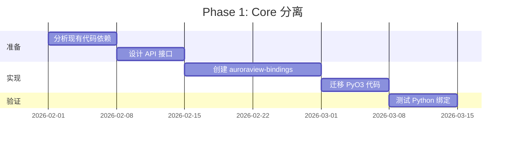
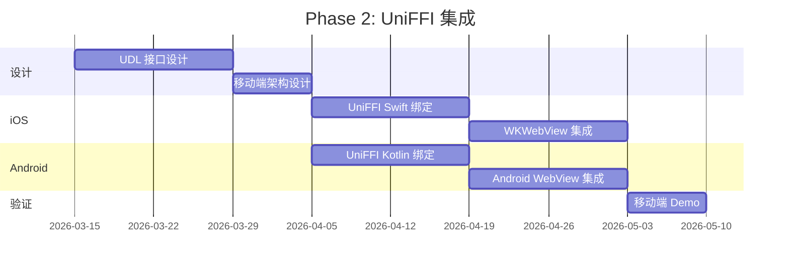
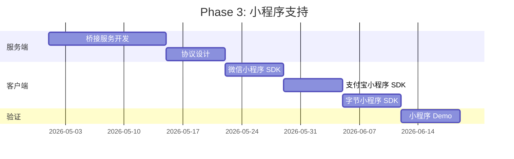

# RFC 0001: AuroraView 跨平台绑定架构重构

- **状态**: Draft
- **作者**: AuroraView Team
- **创建日期**: 2026-01-23
- **目标版本**: 2.0

## 概述

本 RFC 提出将 AuroraView 的 Rust 核心与绑定层分离，以支持：
- **Python/DCC** - 继续使用 PyO3（现有方案）
- **iOS/Android** - 使用 UniFFI 生成 Swift/Kotlin 绑定
- **小程序** - 通过 HTTP/WebSocket 桥接或 WASM

## 动机

当前 AuroraView 的 Rust 核心与 PyO3 绑定紧密耦合。为了支持移动端（iOS/Android）和小程序平台，需要：

1. **完整 WebView 能力复用** - 核心协议、IPC、事件系统在所有平台一致
2. **完整 UI 支持** - 各平台均可运行完整前端 UI
3. **绑定层解耦** - Python 用 PyO3，移动端用 UniFFI，小程序用桥接层

## 目标平台

| 平台 | 绑定方案 | WebView 实现 | 状态 |
|------|---------|-------------|------|
| Windows DCC | PyO3 + maturin | WebView2 | ✅ 现有 |
| macOS DCC | PyO3 + maturin | WKWebView | 🔜 规划中 |
| Linux DCC | PyO3 + maturin | WebKitGTK | 🔜 规划中 |
| iOS | UniFFI → Swift | WKWebView | 📋 本 RFC |
| Android | UniFFI → Kotlin | Android WebView | 📋 本 RFC |
| 微信小程序 | HTTP/WS Bridge | 小程序 WebView | 📋 本 RFC |
| 支付宝/字节小程序 | HTTP/WS Bridge | 小程序 WebView | 📋 本 RFC |

## 架构设计

### 分层架构

```
┌─────────────────────────────────────────────────────────────────────┐
│                         Application Layer                           │
│   gallery / examples / dcc-tools / mobile-apps / mini-programs      │
└─────────────────────────────────────────────────────────────────────┘
                                    │
┌─────────────────────────────────────────────────────────────────────┐
│                         Bindings Layer                              │
│  ┌──────────────┐  ┌──────────────┐  ┌──────────────────────────┐  │
│  │   PyO3       │  │   UniFFI     │  │   Bridge (HTTP/WS/WASM)  │  │
│  │  (Python)    │  │ (Swift/Kt)   │  │      (Mini Programs)     │  │
│  └──────────────┘  └──────────────┘  └──────────────────────────┘  │
└─────────────────────────────────────────────────────────────────────┘
                                    │
┌─────────────────────────────────────────────────────────────────────┐
│                    auroraview-bindings (NEW)                        │
│  ┌─────────────────────────────────────────────────────────────┐   │
│  │  Unified API Layer (Platform-agnostic interfaces)           │   │
│  │  - WebViewHandle, IpcChannel, EventBus                      │   │
│  └─────────────────────────────────────────────────────────────┘   │
└─────────────────────────────────────────────────────────────────────┘
                                    │
┌─────────────────────────────────────────────────────────────────────┐
│                         Core Layer                                  │
│  ┌─────────────┐  ┌─────────────┐  ┌─────────────┐  ┌───────────┐  │
│  │  auroraview │  │  auroraview │  │  auroraview │  │ auroraview│  │
│  │    -core    │  │   -desktop  │  │    -dcc     │  │  -mobile  │  │
│  └─────────────┘  └─────────────┘  └─────────────┘  └───────────┘  │
└─────────────────────────────────────────────────────────────────────┘
                                    │
┌─────────────────────────────────────────────────────────────────────┐
│                        Platform Layer                               │
│  ┌──────────┐  ┌──────────┐  ┌──────────┐  ┌──────────┐            │
│  │ WebView2 │  │WKWebView │  │WebKitGTK │  │ Android  │            │
│  │ (Win32)  │  │ (macOS)  │  │ (Linux)  │  │ WebView  │            │
│  └──────────┘  └──────────┘  └──────────┘  └──────────┘            │
└─────────────────────────────────────────────────────────────────────┘
```

### 新增 Crate 结构

```
crates/
├── auroraview-bindings/          # 🆕 统一绑定层
│   ├── Cargo.toml
│   ├── src/
│   │   ├── lib.rs
│   │   ├── api/                  # 平台无关 API 定义
│   │   │   ├── mod.rs
│   │   │   ├── webview.rs        # WebView 操作接口
│   │   │   ├── ipc.rs            # IPC 通信接口
│   │   │   ├── events.rs         # 事件系统接口
│   │   │   └── window.rs         # 窗口管理接口
│   │   ├── pyo3/                 # PyO3 绑定（现有代码迁移）
│   │   │   ├── mod.rs
│   │   │   └── ...
│   │   ├── uniffi/               # UniFFI 绑定（新增）
│   │   │   ├── mod.rs
│   │   │   ├── auroraview.udl    # UniFFI 接口定义
│   │   │   └── ...
│   │   └── bridge/               # HTTP/WS 桥接（小程序）
│   │       ├── mod.rs
│   │       ├── server.rs
│   │       └── protocol.rs
│   └── uniffi-bindgen/           # UniFFI 生成配置
│
├── auroraview-mobile/            # 🆕 移动端运行时
│   ├── Cargo.toml
│   ├── src/
│   │   ├── lib.rs
│   │   ├── ios/                  # iOS 特定实现
│   │   │   ├── mod.rs
│   │   │   └── wkwebview.rs
│   │   └── android/              # Android 特定实现
│   │       ├── mod.rs
│   │       └── webview.rs
│   ├── ios/                      # Xcode 项目模板
│   └── android/                  # Android 项目模板
│
└── auroraview-miniprogram/       # 🆕 小程序桥接层
    ├── Cargo.toml
    └── src/
        ├── lib.rs
        ├── server.rs             # 本地桥接服务
        ├── wechat.rs             # 微信小程序适配
        ├── alipay.rs             # 支付宝小程序适配
        └── bytedance.rs          # 字节小程序适配
```

## 详细设计

### 1. auroraview-bindings: 统一 API 层

#### 1.1 核心 Trait 定义

```rust
// crates/auroraview-bindings/src/api/webview.rs

/// 平台无关的 WebView 操作接口
pub trait WebViewApi: Send + Sync {
    /// 创建 WebView 实例
    fn create(&self, config: WebViewConfig) -> Result<WebViewHandle, Error>;
    
    /// 导航到 URL
    fn navigate(&self, handle: WebViewHandle, url: &str) -> Result<(), Error>;
    
    /// 加载 HTML 内容
    fn load_html(&self, handle: WebViewHandle, html: &str) -> Result<(), Error>;
    
    /// 执行 JavaScript
    fn eval_js(&self, handle: WebViewHandle, script: &str) -> Result<(), Error>;
    
    /// 执行 JavaScript 并获取结果（异步）
    fn eval_js_async(
        &self, 
        handle: WebViewHandle, 
        script: &str,
        callback: Box<dyn FnOnce(Result<String, Error>) + Send>,
    ) -> Result<(), Error>;
    
    /// 设置窗口边界
    fn set_bounds(&self, handle: WebViewHandle, bounds: Rect) -> Result<(), Error>;
    
    /// 销毁 WebView
    fn destroy(&self, handle: WebViewHandle) -> Result<(), Error>;
}

/// WebView 配置
#[derive(Clone, Debug)]
pub struct WebViewConfig {
    pub url: Option<String>,
    pub html: Option<String>,
    pub title: String,
    pub width: u32,
    pub height: u32,
    pub transparent: bool,
    pub devtools: bool,
    pub user_agent: Option<String>,
}

/// WebView 句柄（跨平台唯一标识）
#[derive(Clone, Copy, Debug, PartialEq, Eq, Hash)]
pub struct WebViewHandle(pub u64);

/// 矩形区域
#[derive(Clone, Copy, Debug)]
pub struct Rect {
    pub x: i32,
    pub y: i32,
    pub width: u32,
    pub height: u32,
}
```

#### 1.2 IPC 接口

```rust
// crates/auroraview-bindings/src/api/ipc.rs

/// IPC 通信接口
pub trait IpcApi: Send + Sync {
    /// 发送消息到前端
    fn post_message(&self, handle: WebViewHandle, message: &str) -> Result<(), Error>;
    
    /// 注册消息处理器
    fn on_message(
        &self,
        handle: WebViewHandle,
        callback: Box<dyn Fn(IpcMessage) + Send + Sync>,
    ) -> Result<(), Error>;
    
    /// 调用前端方法（request-response 模式）
    fn call(
        &self,
        handle: WebViewHandle,
        method: &str,
        params: &str,
        callback: Box<dyn FnOnce(Result<String, Error>) + Send>,
    ) -> Result<(), Error>;
    
    /// 绑定后端方法供前端调用
    fn bind_call(
        &self,
        handle: WebViewHandle,
        method: &str,
        handler: Box<dyn Fn(IpcRequest) -> IpcResponse + Send + Sync>,
    ) -> Result<(), Error>;
}

/// IPC 消息
#[derive(Clone, Debug)]
pub struct IpcMessage {
    pub id: Option<String>,
    pub type_: String,
    pub method: Option<String>,
    pub params: Option<String>,
    pub result: Option<String>,
    pub error: Option<IpcError>,
}

/// IPC 请求
#[derive(Clone, Debug)]
pub struct IpcRequest {
    pub id: String,
    pub method: String,
    pub params: String,
}

/// IPC 响应
#[derive(Clone, Debug)]
pub struct IpcResponse {
    pub ok: bool,
    pub result: Option<String>,
    pub error: Option<IpcError>,
}

/// IPC 错误
#[derive(Clone, Debug)]
pub struct IpcError {
    pub name: String,
    pub message: String,
    pub code: Option<i32>,
}
```

#### 1.3 事件系统接口

```rust
// crates/auroraview-bindings/src/api/events.rs

/// 事件系统接口
pub trait EventApi: Send + Sync {
    /// 触发事件到前端
    fn emit(&self, handle: WebViewHandle, event: &str, data: &str) -> Result<(), Error>;
    
    /// 订阅前端事件
    fn on(
        &self,
        handle: WebViewHandle,
        event: &str,
        callback: Box<dyn Fn(EventData) + Send + Sync>,
    ) -> Result<SubscriptionId, Error>;
    
    /// 取消订阅
    fn off(&self, handle: WebViewHandle, subscription: SubscriptionId) -> Result<(), Error>;
}

/// 事件数据
#[derive(Clone, Debug)]
pub struct EventData {
    pub name: String,
    pub payload: String,
    pub timestamp: u64,
}

/// 订阅 ID
#[derive(Clone, Copy, Debug, PartialEq, Eq, Hash)]
pub struct SubscriptionId(pub u64);
```

### 2. UniFFI 绑定设计（iOS/Android）

#### 2.1 UDL 接口定义

```udl
// crates/auroraview-bindings/src/uniffi/auroraview.udl

namespace auroraview {
    // 初始化 AuroraView 运行时
    void init();
    
    // 获取版本信息
    string version();
};

// WebView 配置
dictionary WebViewConfig {
    string? url;
    string? html;
    string title;
    u32 width;
    u32 height;
    boolean transparent;
    boolean devtools;
    string? user_agent;
};

// 矩形区域
dictionary Rect {
    i32 x;
    i32 y;
    u32 width;
    u32 height;
};

// IPC 错误
dictionary IpcError {
    string name;
    string message;
    i32? code;
};

// IPC 响应
dictionary IpcResponse {
    boolean ok;
    string? result;
    IpcError? error;
};

// WebView 接口
interface AuroraView {
    // 构造函数
    constructor(WebViewConfig config);
    
    // 导航
    [Throws=AuroraViewError]
    void navigate(string url);
    
    [Throws=AuroraViewError]
    void load_html(string html);
    
    // JavaScript 执行
    [Throws=AuroraViewError]
    void eval_js(string script);
    
    [Throws=AuroraViewError]
    string eval_js_sync(string script);
    
    // IPC
    [Throws=AuroraViewError]
    void post_message(string message);
    
    [Throws=AuroraViewError]
    void emit(string event, string data);
    
    // 窗口操作
    [Throws=AuroraViewError]
    void set_bounds(Rect bounds);
    
    [Throws=AuroraViewError]
    void show();
    
    [Throws=AuroraViewError]
    void hide();
    
    [Throws=AuroraViewError]
    void close();
    
    // 属性
    string get_url();
    string get_title();
    boolean is_visible();
};

// 回调接口（用于异步操作和事件）
callback interface MessageCallback {
    void on_message(string message);
};

callback interface EventCallback {
    void on_event(string name, string data);
};

callback interface JsResultCallback {
    void on_result(string result);
    void on_error(string error);
};

// 错误类型
[Error]
enum AuroraViewError {
    "InitializationFailed",
    "WebViewNotFound",
    "NavigationFailed",
    "JsExecutionFailed",
    "IpcError",
    "WindowError",
    "InvalidConfig",
    "PlatformNotSupported",
};
```

#### 2.2 iOS 集成示例

```swift
// iOS/AuroraView.swift

import Foundation
import AuroraViewBindings  // UniFFI 生成的 Swift 绑定

public class AuroraViewManager {
    private var webView: AuroraView?
    
    public init() {
        // 初始化 AuroraView 运行时
        auroraview.init()
    }
    
    public func createWebView(config: WebViewConfig) throws -> AuroraView {
        let view = try AuroraView(config: config)
        self.webView = view
        return view
    }
    
    public func navigate(to url: String) throws {
        guard let webView = webView else {
            throw AuroraViewError.WebViewNotFound
        }
        try webView.navigate(url: url)
    }
    
    public func evalJs(_ script: String, completion: @escaping (Result<String, Error>) -> Void) {
        guard let webView = webView else {
            completion(.failure(AuroraViewError.WebViewNotFound))
            return
        }
        
        let callback = JsResultCallbackImpl(completion: completion)
        webView.evalJsAsync(script: script, callback: callback)
    }
}

// 回调实现
class JsResultCallbackImpl: JsResultCallback {
    let completion: (Result<String, Error>) -> Void
    
    init(completion: @escaping (Result<String, Error>) -> Void) {
        self.completion = completion
    }
    
    func onResult(result: String) {
        completion(.success(result))
    }
    
    func onError(error: String) {
        completion(.failure(NSError(domain: "AuroraView", code: -1, userInfo: [NSLocalizedDescriptionKey: error])))
    }
}
```

#### 2.3 Android 集成示例

```kotlin
// android/AuroraViewManager.kt

package com.auroraview.bindings

import uniffi.auroraview.*

class AuroraViewManager {
    private var webView: AuroraView? = null
    
    init {
        // 初始化 AuroraView 运行时
        auroraview.init()
    }
    
    fun createWebView(config: WebViewConfig): AuroraView {
        val view = AuroraView(config)
        this.webView = view
        return view
    }
    
    fun navigate(url: String) {
        webView?.navigate(url) ?: throw AuroraViewException.WebViewNotFound("")
    }
    
    suspend fun evalJs(script: String): String {
        val webView = this.webView ?: throw AuroraViewException.WebViewNotFound("")
        return suspendCoroutine { continuation ->
            webView.evalJsAsync(script, object : JsResultCallback {
                override fun onResult(result: String) {
                    continuation.resume(result)
                }
                override fun onError(error: String) {
                    continuation.resumeWithException(Exception(error))
                }
            })
        }
    }
    
    fun setMessageCallback(callback: (String) -> Unit) {
        webView?.setMessageCallback(object : MessageCallback {
            override fun onMessage(message: String) {
                callback(message)
            }
        })
    }
}
```

### 3. 小程序桥接层设计

#### 3.1 架构

```
┌─────────────────────────────────────────────────────────────┐
│                     小程序前端 (WXML/JS)                      │
│  ┌─────────────────────────────────────────────────────┐   │
│  │  auroraview-miniprogram-sdk (npm package)           │   │
│  │  - auroraview.call()                                │   │
│  │  - auroraview.on()                                  │   │
│  │  - auroraview.emit()                                │   │
│  └─────────────────────────────────────────────────────┘   │
└─────────────────────────────────────────────────────────────┘
                            │
                     WebSocket / HTTP
                            │
┌─────────────────────────────────────────────────────────────┐
│              auroraview-miniprogram (Rust Server)           │
│  ┌─────────────────────────────────────────────────────┐   │
│  │  Bridge Server (axum/actix-web)                      │   │
│  │  - /api/call      POST  执行方法调用                  │   │
│  │  - /api/emit      POST  触发事件                      │   │
│  │  - /ws            WS    双向通信                      │   │
│  └─────────────────────────────────────────────────────┘   │
│                            │                                │
│  ┌─────────────────────────────────────────────────────┐   │
│  │  auroraview-core (业务逻辑)                          │   │
│  └─────────────────────────────────────────────────────┘   │
└─────────────────────────────────────────────────────────────┘
```

#### 3.2 桥接服务实现

```rust
// crates/auroraview-miniprogram/src/server.rs

use axum::{
    extract::{State, WebSocketUpgrade},
    response::IntoResponse,
    routing::{get, post},
    Json, Router,
};
use serde::{Deserialize, Serialize};
use std::sync::Arc;
use tokio::sync::broadcast;

/// 小程序桥接服务
pub struct BridgeServer {
    app_state: Arc<AppState>,
}

struct AppState {
    // 事件广播通道
    event_tx: broadcast::Sender<BridgeEvent>,
    // 方法处理器注册表
    handlers: dashmap::DashMap<String, Box<dyn Fn(CallRequest) -> CallResponse + Send + Sync>>,
}

#[derive(Debug, Serialize, Deserialize)]
pub struct CallRequest {
    pub id: String,
    pub method: String,
    pub params: serde_json::Value,
}

#[derive(Debug, Serialize, Deserialize)]
pub struct CallResponse {
    pub id: String,
    pub ok: bool,
    #[serde(skip_serializing_if = "Option::is_none")]
    pub result: Option<serde_json::Value>,
    #[serde(skip_serializing_if = "Option::is_none")]
    pub error: Option<ErrorInfo>,
}

#[derive(Debug, Serialize, Deserialize)]
pub struct ErrorInfo {
    pub name: String,
    pub message: String,
    #[serde(skip_serializing_if = "Option::is_none")]
    pub code: Option<i32>,
}

#[derive(Debug, Clone, Serialize, Deserialize)]
pub struct BridgeEvent {
    pub name: String,
    pub data: serde_json::Value,
    pub timestamp: u64,
}

impl BridgeServer {
    pub fn new() -> Self {
        let (event_tx, _) = broadcast::channel(1024);
        Self {
            app_state: Arc::new(AppState {
                event_tx,
                handlers: dashmap::DashMap::new(),
            }),
        }
    }
    
    /// 注册方法处理器
    pub fn bind_call<F>(&self, method: &str, handler: F)
    where
        F: Fn(CallRequest) -> CallResponse + Send + Sync + 'static,
    {
        self.app_state.handlers.insert(method.to_string(), Box::new(handler));
    }
    
    /// 触发事件
    pub fn emit(&self, event: &str, data: serde_json::Value) {
        let _ = self.app_state.event_tx.send(BridgeEvent {
            name: event.to_string(),
            data,
            timestamp: std::time::SystemTime::now()
                .duration_since(std::time::UNIX_EPOCH)
                .unwrap()
                .as_millis() as u64,
        });
    }
    
    /// 构建路由
    pub fn router(&self) -> Router {
        Router::new()
            .route("/api/call", post(handle_call))
            .route("/api/emit", post(handle_emit))
            .route("/ws", get(handle_websocket))
            .with_state(self.app_state.clone())
    }
    
    /// 启动服务
    pub async fn start(&self, addr: &str) -> Result<(), Box<dyn std::error::Error>> {
        let listener = tokio::net::TcpListener::bind(addr).await?;
        axum::serve(listener, self.router()).await?;
        Ok(())
    }
}

async fn handle_call(
    State(state): State<Arc<AppState>>,
    Json(req): Json<CallRequest>,
) -> Json<CallResponse> {
    let response = if let Some(handler) = state.handlers.get(&req.method) {
        handler(req)
    } else {
        CallResponse {
            id: req.id,
            ok: false,
            result: None,
            error: Some(ErrorInfo {
                name: "MethodNotFound".to_string(),
                message: format!("Method '{}' not found", req.method),
                code: Some(-32601),
            }),
        }
    };
    Json(response)
}

async fn handle_emit(
    State(state): State<Arc<AppState>>,
    Json(event): Json<BridgeEvent>,
) -> impl IntoResponse {
    let _ = state.event_tx.send(event);
    Json(serde_json::json!({"ok": true}))
}

async fn handle_websocket(
    State(state): State<Arc<AppState>>,
    ws: WebSocketUpgrade,
) -> impl IntoResponse {
    ws.on_upgrade(move |socket| handle_ws_connection(socket, state))
}

async fn handle_ws_connection(
    mut socket: axum::extract::ws::WebSocket,
    state: Arc<AppState>,
) {
    use axum::extract::ws::Message;
    use futures::{SinkExt, StreamExt};
    
    let mut event_rx = state.event_tx.subscribe();
    
    loop {
        tokio::select! {
            // 接收客户端消息
            Some(msg) = socket.recv() => {
                if let Ok(Message::Text(text)) = msg {
                    if let Ok(req) = serde_json::from_str::<CallRequest>(&text) {
                        let response = if let Some(handler) = state.handlers.get(&req.method) {
                            handler(req)
                        } else {
                            CallResponse {
                                id: req.id,
                                ok: false,
                                result: None,
                                error: Some(ErrorInfo {
                                    name: "MethodNotFound".to_string(),
                                    message: "Method not found".to_string(),
                                    code: Some(-32601),
                                }),
                            }
                        };
                        let _ = socket.send(Message::Text(
                            serde_json::to_string(&response).unwrap().into()
                        )).await;
                    }
                }
            }
            // 推送事件到客户端
            Ok(event) = event_rx.recv() => {
                let _ = socket.send(Message::Text(
                    serde_json::to_string(&event).unwrap().into()
                )).await;
            }
        }
    }
}
```

#### 3.3 小程序 SDK（JavaScript）

```javascript
// packages/auroraview-miniprogram-sdk/src/index.js

/**
 * AuroraView 小程序 SDK
 * 通过 HTTP/WebSocket 与 Rust 后端通信
 */
class AuroraViewMiniProgram {
  constructor(options = {}) {
    this.baseUrl = options.baseUrl || 'http://localhost:8080';
    this.wsUrl = options.wsUrl || 'ws://localhost:8080/ws';
    this.ws = null;
    this.callId = 0;
    this.pendingCalls = new Map();
    this.eventHandlers = new Map();
  }

  /**
   * 连接 WebSocket
   */
  connect() {
    return new Promise((resolve, reject) => {
      // 微信小程序 WebSocket API
      this.ws = wx.connectSocket({
        url: this.wsUrl,
        success: () => resolve(),
        fail: (err) => reject(err),
      });

      this.ws.onMessage((res) => {
        const data = JSON.parse(res.data);
        
        // 处理 call 响应
        if (data.id && this.pendingCalls.has(data.id)) {
          const { resolve, reject } = this.pendingCalls.get(data.id);
          this.pendingCalls.delete(data.id);
          if (data.ok) {
            resolve(data.result);
          } else {
            reject(data.error);
          }
          return;
        }
        
        // 处理事件
        if (data.name) {
          const handlers = this.eventHandlers.get(data.name) || [];
          handlers.forEach(handler => handler(data.data));
        }
      });
    });
  }

  /**
   * 调用后端方法
   */
  call(method, params = {}) {
    const id = `${++this.callId}`;
    
    return new Promise((resolve, reject) => {
      this.pendingCalls.set(id, { resolve, reject });
      
      if (this.ws) {
        // WebSocket 模式
        this.ws.send({
          data: JSON.stringify({ id, method, params }),
        });
      } else {
        // HTTP fallback
        wx.request({
          url: `${this.baseUrl}/api/call`,
          method: 'POST',
          data: { id, method, params },
          success: (res) => {
            this.pendingCalls.delete(id);
            if (res.data.ok) {
              resolve(res.data.result);
            } else {
              reject(res.data.error);
            }
          },
          fail: (err) => {
            this.pendingCalls.delete(id);
            reject(err);
          },
        });
      }
    });
  }

  /**
   * 订阅事件
   */
  on(event, handler) {
    if (!this.eventHandlers.has(event)) {
      this.eventHandlers.set(event, []);
    }
    this.eventHandlers.get(event).push(handler);
    
    // 返回取消订阅函数
    return () => {
      const handlers = this.eventHandlers.get(event);
      const index = handlers.indexOf(handler);
      if (index > -1) {
        handlers.splice(index, 1);
      }
    };
  }

  /**
   * 触发事件到后端
   */
  emit(event, data = {}) {
    return new Promise((resolve, reject) => {
      wx.request({
        url: `${this.baseUrl}/api/emit`,
        method: 'POST',
        data: { name: event, data, timestamp: Date.now() },
        success: () => resolve(),
        fail: (err) => reject(err),
      });
    });
  }

  /**
   * 断开连接
   */
  disconnect() {
    if (this.ws) {
      this.ws.close();
      this.ws = null;
    }
  }
}

// 创建 Proxy API（兼容 auroraview.api.xxx 风格）
function createApiProxy(client) {
  return new Proxy({}, {
    get(target, prop) {
      return (...args) => {
        const params = args.length === 1 && typeof args[0] === 'object'
          ? args[0]
          : args;
        return client.call(`api.${prop}`, params);
      };
    },
  });
}

// 导出
module.exports = {
  AuroraViewMiniProgram,
  createApiProxy,
  
  // 便捷创建函数
  createClient(options) {
    const client = new AuroraViewMiniProgram(options);
    client.api = createApiProxy(client);
    return client;
  },
};
```

### 4. 迁移策略

#### Phase 1: Core 分离（4-6 周）



**目标**：
- 创建 `auroraview-bindings` crate
- 定义平台无关 API trait
- 将现有 `src/bindings/` 迁移到新 crate
- 保证 Python 绑定功能不变

#### Phase 2: UniFFI 集成（6-8 周）



**目标**：
- 实现 UniFFI UDL 接口定义
- 生成 Swift/Kotlin 绑定
- iOS WKWebView 集成
- Android WebView 集成
- 移动端 Demo App

#### Phase 3: 小程序支持（4-6 周）



**目标**：
- 实现桥接服务（HTTP/WebSocket）
- 开发小程序 SDK
- 支持微信/支付宝/字节小程序
- 小程序 Demo

### 5. 风险评估

| 风险 | 影响 | 概率 | 缓解措施 |
|-----|------|-----|---------|
| UniFFI 回调限制 | 高 | 中 | 设计异步回调适配层，使用 oneshot channel |
| 移动端线程模型差异 | 中 | 高 | 主线程调度器，遵循平台规范 |
| 小程序 WebSocket 限制 | 中 | 中 | HTTP fallback，断线重连 |
| 构建复杂度增加 | 低 | 高 | CI/CD 自动化，文档完善 |
| API 兼容性 | 中 | 中 | 版本化 API，渐进式迁移 |

### 6. 依赖项

```toml
# crates/auroraview-bindings/Cargo.toml

[dependencies]
# 核心
auroraview-core = { path = "../auroraview-core" }
serde = { version = "1.0", features = ["derive"] }
serde_json = "1.0"
thiserror = "1.0"

# PyO3 绑定 (feature-gated)
pyo3 = { version = "0.23", features = ["extension-module"], optional = true }

# UniFFI 绑定 (feature-gated)
uniffi = { version = "0.29", optional = true }

[build-dependencies]
uniffi = { version = "0.29", features = ["build"], optional = true }

[features]
default = ["pyo3"]
pyo3 = ["dep:pyo3"]
uniffi = ["dep:uniffi"]
```

```toml
# crates/auroraview-miniprogram/Cargo.toml

[dependencies]
auroraview-core = { path = "../auroraview-core" }
axum = { version = "0.8", features = ["ws"] }
tokio = { version = "1", features = ["full"] }
serde = { version = "1.0", features = ["derive"] }
serde_json = "1.0"
dashmap = "6"
futures = "0.3"
```

### 7. 测试计划

#### 7.1 单元测试

- API trait 实现测试
- IPC 消息序列化/反序列化
- 事件系统测试

#### 7.2 集成测试

- PyO3 绑定功能测试
- UniFFI 生成代码测试
- 桥接服务 HTTP/WebSocket 测试

#### 7.3 平台测试

| 平台 | 测试环境 | 测试内容 |
|-----|---------|---------|
| Windows | CI (Windows Server) | PyO3 绑定，WebView2 |
| macOS | CI (macOS) | PyO3 绑定，WKWebView |
| iOS | Xcode Simulator | UniFFI Swift，WKWebView |
| Android | Android Emulator | UniFFI Kotlin，WebView |
| 微信小程序 | 微信开发者工具 | SDK，桥接服务 |

### 8. 文档计划

- [ ] API 参考文档（Rust/Python/Swift/Kotlin/JS）
- [ ] 移动端集成指南
- [ ] 小程序集成指南
- [ ] 迁移指南（现有项目升级）
- [ ] 架构设计文档

## 附录

### A. 现有代码影响分析

| 文件/模块 | 影响 | 说明 |
|----------|------|-----|
| `src/lib.rs` | 中 | 移除 bindings 模块，改为引用 auroraview-bindings |
| `src/bindings/` | 高 | 整体迁移到 auroraview-bindings/pyo3/ |
| `src/webview/` | 低 | 保持不变，作为 core 实现 |
| `python/auroraview/` | 低 | 保持不变，底层自动切换 |
| `Cargo.toml` | 中 | 添加新 crate 依赖 |

### B. API 兼容性承诺

- Python API 保持 100% 向后兼容
- `auroraview.call()` / `auroraview.on()` / `auroraview.api.*` 语义不变
- 事件名称和数据格式不变

### C. 相关链接

- [UniFFI Book](https://mozilla.github.io/uniffi-rs/)
- [PyO3 User Guide](https://pyo3.rs/)
- [微信小程序 WebSocket API](https://developers.weixin.qq.com/miniprogram/dev/api/network/websocket.html)
- [Qt WebView 源码](https://github.com/nicknisi/webview-qt) (架构参考)
- [Flet SDK](https://github.com/flet-dev/flet) (Python API 设计参考)

## 决策记录

| 日期 | 决策 | 理由 |
|-----|------|-----|
| 2026-01-23 | Python 绑定继续用 PyO3 | 现有代码成熟，PyO3 对 Python 支持最好 |
| 2026-01-23 | 移动端用 UniFFI | 官方支持 Swift/Kotlin，社区活跃 |
| 2026-01-23 | 小程序用 HTTP/WS 桥接 | 小程序无法直接运行 Rust FFI |
